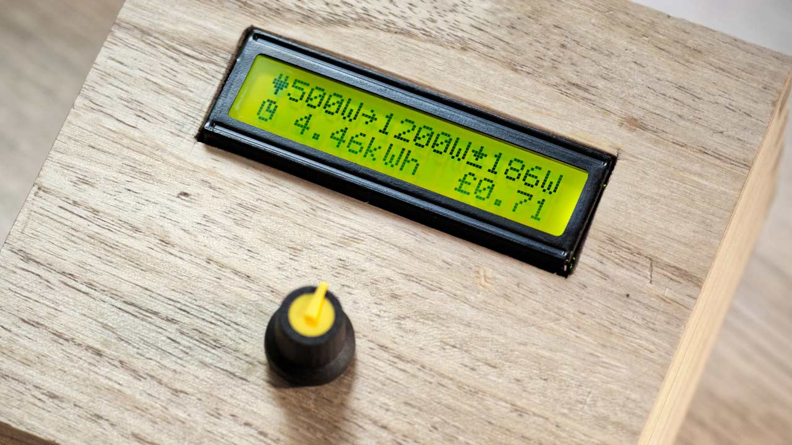

# Photon Home Dashboard

This repository contains the code for home dashboard powered by a [Particle Photon](https://www.particle.io/). It uses a 1602A LCD Display and a rotary encoder as the UI.

For more details of the project see my [blog post at durablescope.com](http://blog.durablescope.com/post/HomeDashboard/).

